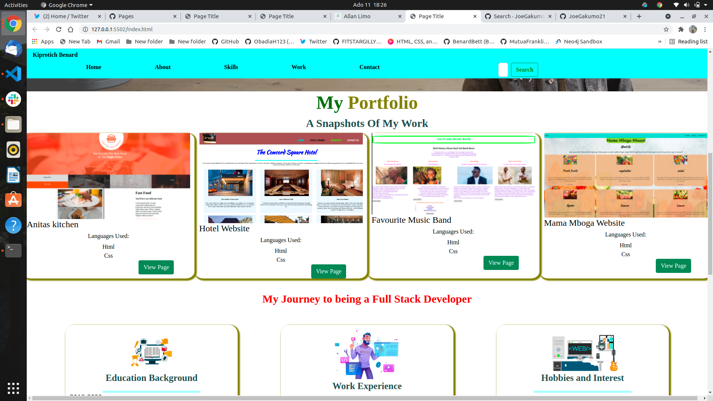
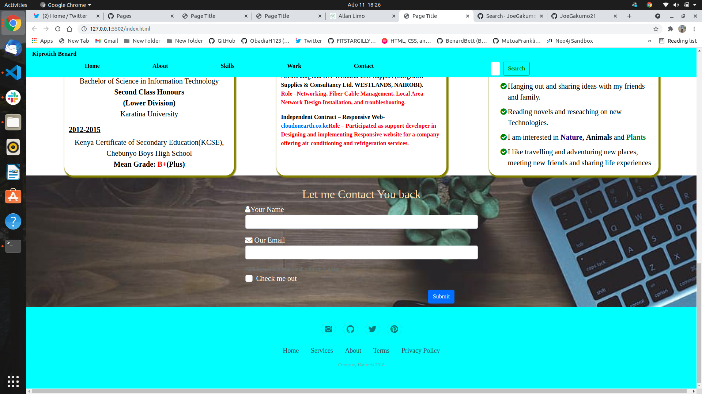

# Landing page of my portfolio
This is a landing page of my portfolio project , it contain active links to showcase some of the projects that have done so far in my journey as a web developer.
## Author
By Kiprotich Bett Bernard
# Description
This project has a navigation bar with 7 items that is my name,portfolio which is home, about, skills, work, contact section and search bar, in that about section you can get to see my story.
The contact section will give you a  way so can leave me a message to reach you later the soonest, entering your email, phone number, and a message.
# active link
[a link] (https://github.com/ObadiaH123/my-portfolio1/)
## screenshots of our website
Home page

&nbsp;

welcome to my portfolio Landing Page, navigate on my website
<image src= "assets/images/landing page.png">

&nbsp;

projects

&nbsp;

Have a look at some of my projects

&nbsp;

about section

&nbsp;

My journey to being a web developer

&nbsp;

contact section and footer

&nbsp;

Get to contact section and leave a message

## Setup/Installation Requirements
git
browser
internet
a pc
text Editor
## known bugs
There are known bugs at the moment
## Technologies used
* HTML
* CSS
* Bootstrap
* Javascript
## contact details
you can reach to me through these contact details: Email:pkobenj41@gmail.com, Tel:+254710383269